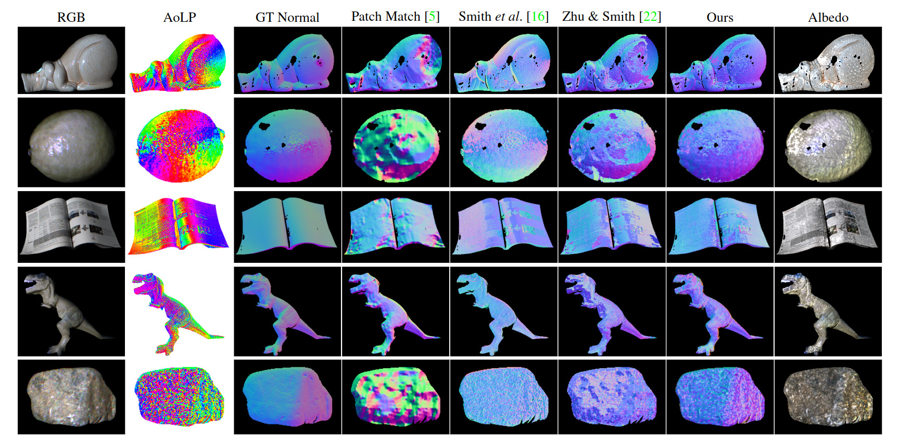

# Polarimetric Normal Stereo Dataset

This repository provides the dataset captured for our paper ["Polarimetric Normal Stereo"](https://openaccess.thecvf.com/content/CVPR2021/html/Fukao_Polarimetric_Normal_Stereo_CVPR_2021_paper.html) in CVPR 2021.
If you use our code and data, please cite our paper.
```
@InProceedings{Fukao_2021_CVPR,
    author    = {Fukao, Yoshiki and Kawahara, Ryo and Nobuhara, Shohei and Nishino, Ko},
    title     = {Polarimetric Normal Stereo},
    booktitle = {Proceedings of the IEEE/CVF Conference on Computer Vision and Pattern Recognition (CVPR)},
    month     = {June},
    year      = {2021},
    pages     = {682-690}
}
```

Please note that this is research software / dataset and may contain bugs or other issues – please use it at your own risk. If you experience major problems with it, you may contact us, but please note that we do not have the resources to deal with all issues.

The dataset contains 5 objects, *book*, *dinosaur*, *lemon*, *pig*, and *stone*.  Each object is captured by stereo [Lucid TRI050S-QC](https://thinklucid.com/ja/product/triton-5-mp-polarization-camera/) cameras.  Surface normals by photometric-stereo and correspondences by structured-light (Gray code) are also provided for reference.



## Download

You can download the dataset from [this link](https://drive.google.com/file/d/1mse2uqCBpwPnk4XgS1vE9IYh4NBK2cFe/view?usp=sharing).

## Files for each object

The ZIP file contains 5 directories named `book`, `dinosaur`, `lemon`, `pig`, and `stone` each of which has the following files.

* `calib.npz`
  * `K`: Intrinsic parameter (same for L and R cameras).
  * `Rmat_W2{L,R}` and `Tvec_W2{L,R}`: Extrinsic parameter to transform a point `X` in WCS to CCS by `Rmat_W2{L,R}` @ `X` + `Tvec_W2{L,R}`.
  * `light_dir`: 5 light directions (from obj to light).
* `gt.npz`
  * `ps_normal_{L,R}`: Pixel-wise normal directions in L and R camera frames measured by photometric-stereo with diffuse coating. 
  * `sl_correspondence_{L2R,R2L}`: Pixel-wise correspondences (left-to-right and right-to-left) measured by structured-light.
  * `mask_L`: Mask to indicate the valid pixels in L image.
* `est.npz`
  * `est_normal`: Estimated normal in L camera frame.
  * `est_disparity`: Estimated disparity in L camera frame.
  * `est_specular_albedo`: Estimated specular albedo in L camera frame. 
  * `est_diffuse_albedo`: Estimated diffuse albedo in L camera frame. 
* `img_L[1-5]_{L,R}.png`: Left and right images captured with each of 5 lighting directions.

Notes:
1. The images and parameters are rectified and undistorted by OpenCV.
2. The parameters and results are provided in [numpy NPZ format](https://numpy.org/doc/stable/reference/generated/numpy.savez.html).
3. Images are provided as *rectified* Quad-Bayer 16-bit PNG.
```
R| R/ G| G/
R\ R- G\ G-
G| G/ B| B/
G\ G- B\ B-
```


## Sample code

The following samples are provided to explain how to use the dataset.  Please use `requirements.txt` or `pnstereo.def` to find the Python packages or to reproduce our [Singularity](https://sylabs.io/) image.

### Demosaicing
```
$ python3 sample_demosaic.py book/img_L1_L.png out.png
```
This sample does Bayer-to-RGB demosaicing.  Open `out.png` to see the result.


### Triangulation
```
$ python3 sample_triangulate.py ./book out.ply
```
This sample triangulates the object surface points using the ground-truth correspondences.  Open `out.ply` by [meshlab](https://www.meshlab.net/) or similar software.


